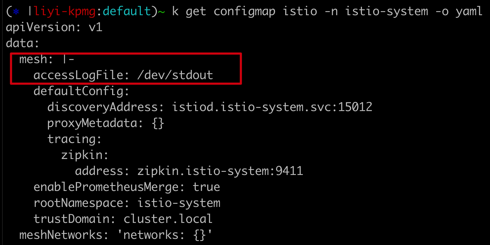
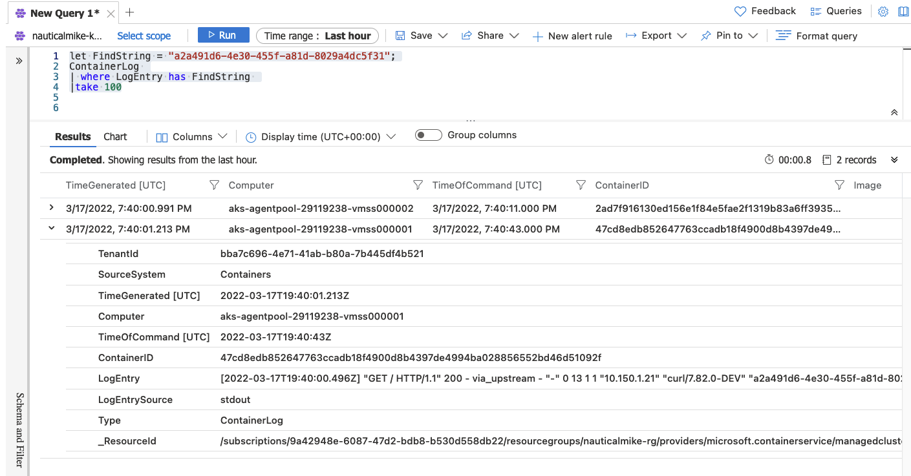
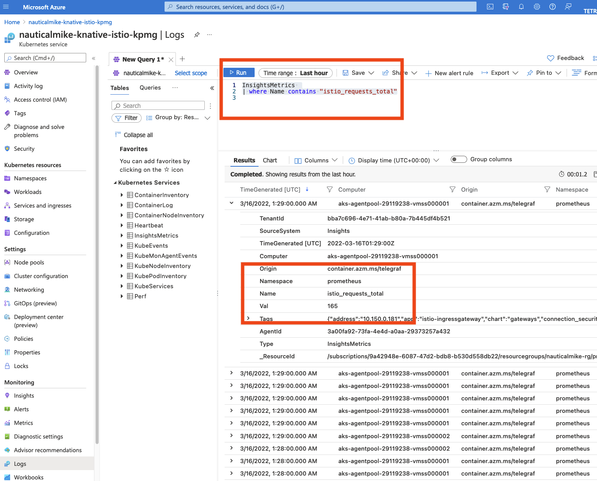
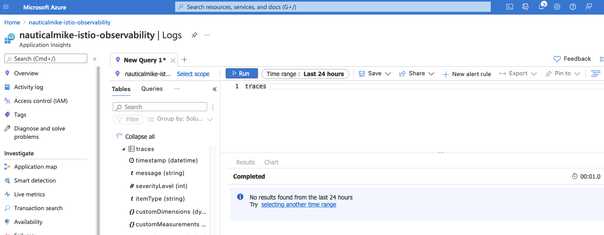

# Istio Observability on Azure Monitor

The purpose of this lab is to explore the current options available to export Istio known observability mechanisms to Azure Monitor, including concerns like: 

- Service mesh console
- Centralized Dashboards
- Logging
- Metrics
- Distributed tracing

***

## Service Mesh Console => Kiali


Kiali is the management console for Istio service mesh, it could be installed as an add-on and it could be a trusted part of your production environment. 

At the time of writing, Kiali is the default and only visualization tool for Istio and it could be installed on a production setting (https://kiali.io/docs/installation/installation-guide/). Also at the time of writing, Azure Monitor doesn't include a Kiali-like console for Istio service mesh management.

There is a discussion taking place to use Kiali for OSM which could open the door for other providers to offer a standardized way for service mesh management (https://github.com/kiali/kiali/discussions/4166).

The recommendation in this case is if you are going to use Istio and need a visual management console, then just use Kiali as there are no other "turn-around" consoles to use for the same purpose and creating one on Azure Monitor could be a significant endeavor.

***

## Centralized Dashboards => Grafana

Grafana is an open source analytics and interactive visualization web application for centralized dashboards. Azure Monitor has a similar idea implemented under the `Application Insights` umbrella, where you can centralize metrics and dashboards from different data sources into one logical entity. 

Both Grafana and Insights provide powerful features for diagnostics, alerting and failure management under a "single pane of glass" having Azure Monitor telemetry features a much larger footprint than Grafana.

When it comes to Istio concerns, Grafana being an open source project provides a set of loaded dashboards customized for Istio (https://gcsweb.istio.io/gcs/istio-release/releases/1.12.5/grafana/), including:

- Mesh dashboard
- Performance dashboard
- Service dashboard
- Workload dashboard
- Extension dashboard
- Pilot dashboard

The recommendation in this case is to use Grafana's dashboards instead of trying to recreate the same on Azure Monitoring, which could be done by "reverse engineering" the dashboards and importing the same data sources used into Azure Monitor. This as expected, could require a significant amount of time to accomplish.

The recommendation is to use the out of the box Grafana-Istio dashboards and in the case of having a Grafana instance is not something feasible, then analyze the gap and create custom Azure monitor dashboards.

***

## Logging => Access Logging

Logging is one of the most important and traditional observability concerns. AKS comes built in with container logging monitoring when Azure AKS monitoring is enabled on the cluster. This means `stdout` and `stderr` is automatically collected by insights. For more information read [here.](https://docs.microsoft.com/en-us/azure/azure-monitor/containers/container-insights-agent-config)

The simplest kind of Istio logging is Envoy’s access logging. Envoy proxies print access information to their standard output. The standard output of Envoy’s containers can then be printed by the kubectl logs command.

The recommended way to enable access logging is using the Telemetry API, see the file named `access-logging.yaml` in this folder which enables mesh wide access logging using envoy as log provider.

Similar configuration can also be applied on an individual namespace, or to an individual workload, to control logging at a fine grained level.

The following short lab presents a quick way to enable Istio access logging and observe it using Azure monitor.

***
## Lab Prerequisites

- AKS cluster
- Monitoring enabled on your AKS instance
- `sleep` and `hello-world` Workloads with metrics exposed

## LAB: Istio Access Logging on Azure Monitor

The Istio Telemetry API exposes a `Telemetry` resource that can be used to configure the mesh telemetry settings. The following can be used to enable envoy as the access log provider across the mesh:

```
apiVersion: telemetry.istio.io/v1alpha1
kind: Telemetry
metadata:
  name: mesh-default
  namespace: istio-system
spec:
  accessLogging:
    - providers:
      - name: envoy
```

Apply the resource to your cluster:

```
kubectl apply -f access-logging.yaml
```

In addition to applying this resource, you need to make sure the `istio` ConfigMap on the `istio-system` namespace has the `meshConfig` path for Envoy's access logs: `/dev/stdout`.

You can accomplish this by adding it to the ConfigMap:



You can also add the config when using the Istio Operator:

```
spec:
  meshConfig:
    accessLogFile: /dev/stdout
```

Or when using the `istioctl install` command:

```
istioctl install <flags-you-used-to-install-Istio> --set meshConfig.accessLogFile=/dev/stdout
```

Now that you have the configuration for access logging in place, generate some load from the `sleep` service to the `hello-world` service:

```
kubectl exec $SLEEP_POD -it -- curl hello.default
```

Inspect the logs for each service's `istio-proxy` container and you should see the request source and destination:

For `sleep`:
```
kubectl logs $SLEEP_POD -c istio-proxy
```
expect a log like:
```
[2022-03-17T19:39:58.072Z] "GET / HTTP/1.1" 200 - via_upstream - "-" 0 13 2445 2444 "-" "curl/7.82.0-DEV" "a2a491d6-4e30-455f-a81d-8029a4dc5f31" "hello.default" "10.150.0.186:8012" outbound|80||hello-world.default.svc.cluster.local 10.150.1.21:46372 10.0.28.127:80 10.150.1.21:43916
```

Now for `hello-world`:
```
export HELLO_POD=$(kubectl get pod -l app=hello-world -ojsonpath='{.items[0].metadata.name}')
kubectl logs $HELLO_POD -c istio-proxy
```
expect a log like:
```
[2022-03-17T19:40:29.074Z] "GET /metrics HTTP/1.1" 200 - via_upstream - "-" 0 49 0 0 "-" "Go-http-client/1.1" "07162f64-94fe-4c42-8542-711f9b805151" "10.150.0.139:9090" "10.150.0.139:9090" inbound|9090|| 127.0.0.6:39535 10.150.0.139:9090 10.150.0.249:44576 - default
```

Take a note on the "long" id shared on the log, those are the `X-REQUEST-ID` of the transaction, save both for a later search.

For more information about the `x-request-id` header read [here.](https://www.envoyproxy.io/docs/envoy/latest/configuration/http/http_conn_man/headers#x-request-id)

You can customize how Envoy's access logging works, for more information read [here.](https://www.envoyproxy.io/docs/envoy/latest/configuration/observability/access_log/usage)

If everything was properly configured then by just exposing these logs over `stdout` we can query them over Azure Monitor logs. On the UI go to your AKS cluster -> Monitoring -> Logs and run a query similar to the following one, replacing the `x-request-id`:

```
let FindString = "a2a491d6-4e30-455f-a81d-8029a4dc5f31";
ContainerLog 
| where LogEntry has FindString 
|take 100
```

You should expect to see something similar to this:



***
NOTE:
Take into account Azure Monitor agents takes  more time than other agents in this space to report logs and it could take up to 20 minutes for them to appear on the monitoring side.
***
NOTE: If you don't want to use Azure built-in agents to "ship" the logs to Azure, there are other alternatives like using FluentBit directly. Note too that these Azure agents are actually based on FluentBit and Telegraf.
***

## Metrics => Prometheus

Prometheus is a time series DB used as a metrics-based monitoring system. Azure Monitor provides the ability out of the box to scrape prometheus-like metrics exposed from workloads into Insights. 

This happens when you enable Monitoring on your AKS cluster and configure its agents to scrape the endpoints of your workloads in a similar way a Prometheus instance would do.

The following lab presents the steps on how to enable this metrics integration.

***

### Lab Prerequisites

- AKS cluster
- Monitoring enabled on your AKS instance
- `sleep` and `hello-world` Workloads with metrics exposed
### LAB: Prometheus Style Metrics

Azure monitor supports Prometheus like monitoring by using the same annotations used on pods to report metrics used in a traditional Prometheus setup. Your pod needs to expose the endpoints to be scraped for monitoring and they can be discovered using the following annotations:
```
prometheus.io/scrape: 'true'
prometheus.io/path: '/data/metrics'
prometheus.io/port: '80'
```

Using our `sleep` pod example we can check the pod's annotations:

```
kubectl  get pod $SLEEP_POD -o jsonpath='{.metadata.annotations}' | yq -P
```

Now observe the following annotations:
```
prometheus.io/path: /stats/prometheus
prometheus.io/port: 15020
prometheus.io/scrape: true
```

These annotations are used to "tell" Prometheus if this pod should be scrapped and the path/port where to do it. Azure Monitor integrations leverages these same annotations without the need to have a Prometheus instance running.

If you remote shell into your sleep pod you can see the stats being exposed on the path mentioned above:

```
kubectl exec $SLEEP_POD -it -- curl localhost:15020/stats/prometheus
```

You should see different key-value pairs being printout corresponding to the metrics exposed, like:

```
istio_agent_pilot_xds_push_time_bucket{type="sds",le="0.01"} 2
istio_agent_pilot_xds_push_time_bucket{type="sds",le="0.1"} 2
istio_agent_pilot_xds_push_time_bucket{type="sds",le="1"} 2
istio_agent_pilot_xds_push_time_bucket{type="sds",le="3"} 2
istio_agent_pilot_xds_push_time_bucket{type="sds",le="5"} 2
istio_agent_pilot_xds_push_time_bucket{type="sds",le="10"} 2
istio_agent_pilot_xds_push_time_bucket{type="sds",le="20"} 2
istio_agent_pilot_xds_push_time_bucket{type="sds",le="30"} 2
istio_agent_pilot_xds_push_time_bucket{type="sds",le="+Inf"} 2
istio_agent_pilot_xds_push_time_sum{type="sds"} 0.001536782
istio_agent_pilot_xds_push_time_count{type="sds"} 2
```

You can check the `hello-world` pod the same way:

```
kubectl exec $HELLO_POD -it -- curl localhost:15020/stats/prometheus | grep istio
```

Now that we know our workload exposes "prometheus-style" metrics and having Azure monitoring enabled on your AKS cluster, lets validate we have the insights agent pods running:

```
kubectl get pods -n kube-system | grep oms
```

You should see a ReplicaSet with the name `omsagent` running:


***
NOTE: If you don't see the pod, probably Monitor is not enabled on your AKS cluster, follow this [article](https://docs.microsoft.com/en-us/azure/azure-monitor/containers/container-insights-onboard) to set it up.
*** 

Azure monitoring configuration is managed by the K8s ConfigMap named `container-azm-ms-agentconfig`, you can find a copy of it [here](https://github.com/microsoft/OMS-docker/blob/ci_feature_prod/Kubernetes/container-azm-ms-agentconfig.yaml). 

In this ConfigMap, you can find a section called `prometheus-data-collection-settings` where we can configure how the metrics are going to be scraped. In our case we are going to enable the cluster-wide monitoring by doing:

```
monitor_kubernetes_pods = true
```

Now you can apply this ConfigMap:

```
kubectl apply -f container-azm-ms-agentconfig.yaml
```

Now list all the pods on the `kube-system` ns and look for the pod name starting `omsagent-rs-` which should be restarting with the new settings. In order to make sure the new configuration took effect, you need to inspect the logs after the pod has restarted:

```
kubectl logs omsagent-rs-<YOUR_RS> -n kube-system
```

***
NOTE:
Take into account Azure Monitor agents takes  more time than other agents in this space to report logs and it could take up to 20 minutes for them to appear on the monitoring side.
***

You should see logs for processing the Prometheus configuration like these:

```
****************Start Prometheus Config Processing********************
config::configmap container-azm-ms-agentconfig for settings mounted, parsing values for prometheus config map
config::Successfully parsed mounted prometheus config map
config::Successfully passed typecheck for config settings for replicaset
config::Starting to substitute the placeholders in telegraf conf copy file for replicaset
config::Successfully substituted the placeholders in telegraf conf file for replicaset
config::Successfully created telemetry file for replicaset
****************End Prometheus Config Processing********************
```

and you should see logs for FluentBit and Telegraf starting:

```
Fluent Bit v1.7.8
* Copyright (C) 2019-2021 The Fluent Bit Authors
* Copyright (C) 2015-2018 Treasure Data
* Fluent Bit is a CNCF sub-project under the umbrella of Fluentd
* https://fluentbit.io

Routing container logs thru v2 route... 
waitforlisteneronTCPport found listener on port:25226 in 1 secs
Telegraf 1.20.3 (git: HEAD 7a4e60aa)
2022-03-15T15:57:52Z I! Starting Telegraf 1.20.3
td-agent-bit 1.7.8
stopping rsyslog...
 * Stopping enhanced syslogd rsyslogd
   ...done.
getting rsyslog status...
 * rsyslogd is not running
2022-03-15T15:57:52.1866550Z: Onboarding success. Sucessfully registered certificate with OMS Homing service.
Onboarding success
```

***
NOTE: Make sure you track down and correlate the Telegraf timestamps to make sure your new configuration took effect. I experienced several times my agent pods not restarting or just not taking the configuration as expected.
***

### How to view monitoring metrics on Azure Monitor

On your Azure console go to your AKS cluster -> Monitoring -> Logs and run a query similar to the following one:

```
InsightsMetrics 
| where Name contains "istio_requests_total"
```

***
NOTE: The `istio_requests_total` is the same Istio metric we used on the previous section to showcase Prometheus.
***

You should be able to see the same metrics for `istio_requests_total` observed previously on Prometheus or when scraping the `sleep` or `hello-world` services:



Notice all the metrics collected from all the workloads on the cluster using the "prometheus-style" annotations. These should include the `sleep`, `hello-world` workloads as well as the Istio's `ingressgateway`. 

You can filter the metrics even more by using tags as follows:

```
InsightsMetrics 
| where Name contains "istio_requests_total"
| where Tags contains "sleep"
```

You should see now only `istio_requests_total` metrics for the `sleep` service.
 
***

 ## Distributed Tracing => Zipkin / Jaeger / Lightstep

From Istio's documentation website: distributed tracing enables users to track a request through mesh that is distributed across multiple services. This allows a deeper understanding about request latency, serialization and parallelism via visualization.

Istio leverages [Envoy’s distributed tracing](https://www.envoyproxy.io/docs/envoy/v1.12.0/intro/arch_overview/observability/tracing) feature to provide tracing integration out of the box. Specifically, Istio provides options to install various tracing backend and configure proxies to send trace spans to them automatically. See [Zipkin](https://istio.io/latest/docs/tasks/observability/distributed-tracing/zipkin/), [Jaeger](https://istio.io/latest/docs/tasks/observability/distributed-tracing/jaeger/) and [Lightstep](https://istio.io/latest/docs/tasks/observability/distributed-tracing/lightstep/) task docs about how Istio works with those tracing systems.

Current efforts are trying to converge some of the presented observability concerns into an open standard to be used across the industry. [OpenTelemetry](https://opentelemetry.io/) is getting traction in this field and recently, Microsoft announced the adoption of the standard but there is a lot of work still to be done. See [here.](https://github.com/open-telemetry/opentelemetry-collector-contrib/issues/433)

In the `OpenTelemetry` world, a collector is a vendor-agnostic implementation with the purpose to receive, process and export telemetry data.

For Istio's out of the box distributed tracing configuration please use Zipkin or Jaeger to explore further, but if the intention is to use Azure Monitor, then some integration using `OpenTelemetry` is needed.  

Istio's tracing is based on Envoy's tracing which uses `B3` headers to propagate and send the span information to be correlated into a single trace. At the time of writing, Azure Monitor's tracing is not compatible with `B3` headers and instead it uses `W3C` style headers compatible with OpenTelemetry. 

For this reason we need to use an `otel` (OpenTelemetry) collector to receive the Istio `B3` style headers and process them to be exported using and Azure compatible exporter with the purpose to get those traces to Azure Monitor's collector. 

Using an `otel` collector, the tracing telemetry would flow like:

`Envoy Sidecar -> Zipkin-style span data -> OTel -> azure span data -> Azure collector`

***
NOTE:
The following lab brings hands-on experience on how to use this instrumentation, but at the time of writing it is not an Azure supported OpenTelemetry exporter. Read more [here](https://docs.microsoft.com/en-us/azure/azure-monitor/app/opentelemetry-overview#sending-your-telemetry).
***

### Lab Prerequisites

- AKS cluster
- Monitoring enabled on your AKS instance
- Istio Service Mesh
- hello-world and sleep services

### LAB: Otel Collector to Azure Monitor

The idea behind this Lab is to use an OpenTelemetry [collector](https://github.com/open-telemetry/opentelemetry-collector), specifically [this](https://github.com/open-telemetry/opentelemetry-collector-contrib/tree/main/exporter/azuremonitorexporter) collector to receive the mesh tracing data on a zipkin receiver and then export it using a custom `azuremonitorexporter` exporter.

Take a look at the file named `otel-config.yaml` where we have three k8s resources, the otel ConfigMap, the otel collector Deployment and it's corresponding service.

Note that there is an `instrumentation_key` property used on the ConfigMap, you can add your own key from the Overview section on your Application Insights:


You can also validate with the following command if `application-insights` extension was added to your AKS cluster:

```
az extension list
```

You should see an output like:

```
[
  {
    "experimental": false,
    "extensionType": "whl",
    "name": "application-insights",
    "path": "/Users/nauticalmike/.azure/cliextensions/application-insights",
    "preview": true,
    "version": "0.1.15"
  }
]
```

You can also validate with the following command if your `ApplicationInsights` component is enabled:

```
az monitor app-insights component show
```

You should be able to see your `instrumentationKey`, `subscription` and `IngestionEndpoint`.

Change the `otel-collector-conf` ConfigMap with the corresponding values of your `ApplicationInsights` instance and apply it:

```
kubectl create ns tracing
kubectl apply -f otel-config.yaml 
```

Take a moment to check the resources just applied.

Check the pods on the `tracing` ns to make sure the collector pod is up:

```
kubectl get pods -n tracing
```

Note that there is only one container corresponding to the collector and there is no sidecar. The `tracing` ns is not annotated for sidecar injection therefore the pods in this ns are not part of the mesh:

```
kubectl get ns -Listio-injection
```

Now lets check the collector logs to get some insights:

```
kubectl logs otel-collector-75754b9c66-rnq4k -n tracing
```

You should be able to see something like:

```
2022-03-22T20:45:05.098Z        info    service/collector.go:190        Applying configuration...
2022-03-22T20:45:05.099Z        info    builder/exporters_builder.go:254        Exporter was built.     {"kind": "exporter", "name": "azuremonitor"}
2022-03-22T20:45:05.100Z        info    builder/exporters_builder.go:254        Exporter was built.     {"kind": "exporter", "name": "logging"}
2022-03-22T20:45:05.100Z        info    builder/pipelines_builder.go:222        Pipeline was built.     {"name": "pipeline", "name": "traces"}
2022-03-22T20:45:05.100Z        info    builder/receivers_builder.go:224        Receiver was built.     {"kind": "receiver", "name": "zipkin", "datatype": "traces"}
2022-03-22T20:45:05.101Z        info    service/service.go:86   Starting extensions...

etc...

2022-03-22T20:45:05.104Z        info    service/collector.go:239        Starting otelcontribcol...      {"Version": "bb95489", "NumCPU": 2}
2022-03-22T20:45:05.104Z        info    service/collector.go:135        Everything is ready. Begin running and processing data.
```

Note how the two exporters we defined in the cm `azuremonitor` and `logging` were built as well as our `zipkin` receiver.


Now lets generate a trace manually and send it to the collector service directly to check is working properly. Generate a timestamp and replace it on the `trace.json` file:

```
echo '('`date +"%s"."%n"` ' * 1000000)/1' | bc
```

Save the `trace.json` file and copy it to the sleep container:

```
kubectl cp trace.json default/$SLEEP_POD:/tmp
```

Now use the `sleep` service to send this trace directly to the collector's endpoint:

```
kubectl exec $SLEEP_POD -it -- curl otel-collector.tracing:9411/api/v2/spans -H "Content-Type: application/json" -d @/tmp/trace.json
```

Check again the collector logs and you should see an entry corresponding to the json object sent:

```
2022-03-22T23:23:30.351Z        INFO    loggingexporter/logging_exporter.go:40  TracesExporter  {"#spans": 1}
2022-03-22T23:23:30.351Z        DEBUG   loggingexporter/logging_exporter.go:49  ResourceSpans #0
Resource labels:
     -> service.name: STRING(api)
InstrumentationLibrarySpans #0
InstrumentationLibrary  
Span #0
    Trace ID       : 5982fe77008310cc80f1da5e10147538
    Parent ID      : 90394f6bcffb5d16
    ID             : 67fae42571535f62
    Name           : /m/n/2.6.1
    Kind           : SPAN_KIND_SERVER
    Start time     : 2022-03-22 23:23:03 +0000 UTC
    End time       : 2022-03-22 23:23:03.026 +0000 UTC
    Status code    : STATUS_CODE_UNSET
    Status message : 
Attributes:
     -> http.method: STRING(POST)
     -> http.scheme: STRING(http)
     -> http.target: STRING(/api/v2/spans)
     -> http.status_code: STRING(202)
     -> http.client_ip: STRING(10.150.1.15)
     -> http.flavor: STRING(1.1)
     -> http.host: STRING(zipkin)
     -> peer.service: STRING(apip)
```

Now that we know our collector is getting the traces correctly, we are going to change the mesh configuration to tell Istio where to send the Zipkin traces. This can be done live by editing the `istio` configmap on the `istio-system` ns:

```
kubectl edit cm istio -n istio-system
```

Change or add the address as follows:

```
defaultConfig:
  tracing:
    zipkin:
      address: otel-collector.tracing.svc:9411
```

Which is where our collector lives. 

Now we are going to generate some traffic using our previous `sleep` and `hello-world` services:

```
kubectl exec $SLEEP_POD -it -- curl hello.default
kubectl exec $SLEEP_POD -it -- curl hello.default
kubectl exec $SLEEP_POD -it -- curl hello.default
```

Now lets tail the collector logs again and you should see the traces coming in from the mesh:

```
2022-03-22T22:53:07.360Z        INFO    loggingexporter/logging_exporter.go:40  TracesExporter  {"#spans": 1}
2022-03-22T22:53:07.360Z        DEBUG   loggingexporter/logging_exporter.go:49  ResourceSpans #0
Resource labels:
     -> service.name: STRING(autoscaler.knative-serving)
InstrumentationLibrarySpans #0
InstrumentationLibrary  
Span #0
    Trace ID       : 2b5bbe79c32624beeba0f59fa7fbef43
    Parent ID      : 
    ID             : eba0f59fa7fbef43
    Name           : hello-world-private.default.svc.cluster.local:9090/*
    Kind           : SPAN_KIND_CLIENT
    Start time     : 2022-03-22 22:53:06.930776 +0000 UTC
    End time       : 2022-03-22 22:53:06.932134 +0000 UTC
    Status code    : STATUS_CODE_UNSET
    Status message : 
Attributes:
etc..
```

Note to this point we proved how the `zipkin` receiver gets the traces from the mesh and then the collector's `logging` exporter logs the traces to the collector's container `stdout`. 

The otel `azuremonitorexporter` job is to convert these traces to the Azure data model and send them to the defined endpoint using the `instrumentation_key`. Unfortunately there seems to be a bug on the exporter and the instrumentation is not working properly.

If the instrumentation were to work according to the Azure telemetry API, then the zipkin-style (b3 headers) traces are converter to the W3C style OpenTelemetry uses and could be visible under:

```
Application Insights -> Logs -> query -> traces
```



