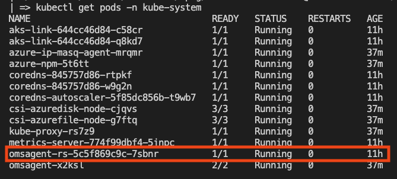

# Istio Observability on Azure Monitor

The purpose of this lab is to explore the current options available to export Istio known observability mechanisms to Azure Monitor, including concerns like: logging, distributed tracing, metrics, dashboards and service mesh consoles.  

## Service Mesh Console == Kiali
Kiali is the management console for Istio service mesh, it could be installed as an add-on, and it could be a trusted part of your production environment. At the time of writing, Kiali is the default and only visualtitation tool for Istio and could be installed for production (https://kiali.io/docs/installation/installation-guide/) and Azure Monitor doesn't include a Kiali like console for Istio service mesh management.

There is a discussion taking place to use Kiali for OSM which could open the door for other provider to offer a standardize way for service mesh management (https://github.com/kiali/kiali/discussions/4166).

The recommendation in this case is if you are going to use Istio and need a visual management console, then just use Kiali.

## Centralized Dashboards == Grafana
Grafana is an open source analytics and interactive visualization web application for centralized dashboards. Azure Monitor has a similar idea implemented under the `Application Insights` umbrella, where you can centralize metrics and dashboards from different data sources into one logical entity. 

Both Grafana and Insights provide powerful features for diagnostics, alerting and failure management under a "single pane of glass" having Azure Monitor telemetry features a much larger footprint than Grafana.

When it comes to Istio concerns, Grafana being an open source project provides a set of loaded dashboards customized for Istio (https://gcsweb.istio.io/gcs/istio-release/releases/1.12.5/grafana/), including:

- Mesh dashboard
- Performance dashboard
- Service dashboard
- Workload dashboard
- Extension dashboard
- Pilot dashboard

The recommendation in this case is to use Grafana's dashboards instead of trying to recreate the same on Azure Monitoring, which could be done by "reverse enginering" and importing the same data sources used on these dashboards into Azure Monitor and then create them. This as expected, could require a significant amount of time to accomplish.

## Distributed Tracing == Zipkin / Jaeger / Lightstep
TLDR

## Logging 
Logging is one of the most important and traditional observability concerns. AKS comes built in with container logging when monitoring is enabled on the cluster.

The simplest kind of Istio logging is Envoy’s access logging. Envoy proxies print access information to their standard output. The standard output of Envoy’s containers can then be printed by the kubectl logs command.

The recommended way to enable access logging is using the Telemetry API, see the file named `access-logging.yaml` which enables mesh wide access logging using envoy as log provider:
```
apiVersion: telemetry.istio.io/v1alpha1
kind: Telemetry
metadata:
  name: mesh-default
  namespace: istio-system
spec:
  accessLogging:
    - providers:
      - name: envoy

```

Similar configuration can also be applied on an individual namespace, or to an individual workload, to control logging at a fine grained level.


## Explanation

## Lab Prerequisites
- Azure k8s cluster
- Azure Monitor enabled on your AKS instance
- Istio + Knative
- Workload with metrics exposed
## Prometheus Style Metrics Lab

1. Azure monitor supports Prometheus like monitoring by using the same annotations used on pods to report metrics used in a traditional Prometheus setup. Your pod needs to expose the endpoints to be scraped for monitoring and they can be discovered using the following annotations:
```
prometheus.io/scrape: 'true'
prometheus.io/path: '/data/metrics'
prometheus.io/port: '80'
```

Using our sleep pod example we can `describe` the pod and observe the following annotations:
```
prometheus.io/path: /stats/prometheus
prometheus.io/port: 15020
prometheus.io/scrape: true
```

If you remote shell into your sleep pod you can see the stats being exposed on the path mentioned above:
```
kubectl exec sleep-557747455f-tdbjk -it -- /bin/sh
```
```
curl localhost:15020/stats/prometheus
```
You should see different key-value pairs being printout corresponding to the metrics exposed at the envoy proxy level.

1. Now that we now our workload exposes metrics "Prometheus" style and having Monitor enabled on your AKS cluster, lets validate we have the conrainer insights pods running:
```
kubectl get pods -n kube-system
```
You should see and `omsagent` pod running:


    If you don't see the pod, probably Monitor is not enabled on your AKS cluster, follow this [article](https://docs.microsoft.com/en-us/azure/azure-monitor/containers/container-insights-onboard) to set it up. 

1. Azure monitoring configuration is managed by the K8s ConfigMap named `container-azm-ms-agentconfig`, you can also find a copy of it [here](https://github.com/microsoft/OMS-docker/blob/ci_feature_prod/Kubernetes/container-azm-ms-agentconfig.yaml) in case yours comes empty. 

In this ConfigMap `prometheus-data-collection-settings` we can specify how the metrics are going to be scraped, you can declare specific URLs, pods, ports etc. In our case we are going to enable the cluster-wide monitoring and the port and path used by our `sleep` and `hello-world` pods:
```
monitor_kubernetes_pods = true
```

Now you can apply this ConfigMap:
```
kubectl apply -f container-azm-ms-agentconfig.yaml
```

Now list all the pods on the `kube-system` ns and look for the pod name starting `omsagent-rs-` which should be restarting with the new settings and check its logs when up:
```
kubectl logs omsagent-rs-5c5f869c9c-7sbnr -n kube-system
```
You should see logs for FluentBit and Telegraf starting.

## How to view monitoring metrics on Azure Monitor

 